<p align="center">
    <a href="https://jupyter-ijavascript-utils.onrender.com/" alt="Documentation">
        
    </a>
    <a href="https://jupyter-ijavascript-utils.onrender.com/LICENSE" alt="License">
        
    </a>
    
    <a href="https://github.com/paulroth3d/jupyter-ijavascript-utils" alt="npm">
        
    </a>
</p>

# Overview

This is a library to help people that understand JavaScript
to leverage for using Jupyter with the iJavaScript kernel
as a way to load and explore data, and ultimately tell compelling stories with visuals.

Notebooks are a way to explore and experiment, in addition to write and explain ideas.

**All of the tutorials provided here, including this one, was written as a notebook and simply exported.**

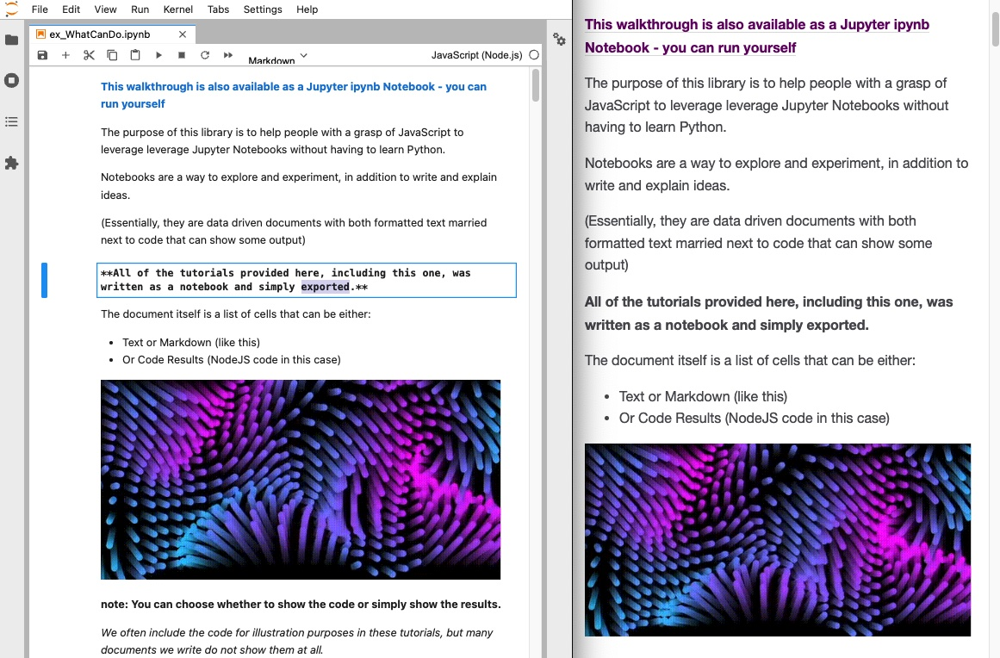

# Documentation

See documentation at: [https://jupyter-ijavascript-utils.onrender.com/](https://jupyter-ijavascript-utils.onrender.com/)

# What is this?

The [jupyter-ijavascript-utils](https://www.npmjs.com/package/jupyter-ijavascript-utils) library is simply a collection of utility methods for Node and JavaScript Developers interested in Data Science.

* Load
* Aggregate
* Manipulate
* Format / Visualize
* Refine and Explore
* Export

Currently, we assume you'll be using [nriesco's iJavaScript Jupyter Kernel](https://github.com/n-riesco/ijavascript) and the [Jupyter Lab - the latest interface for Jupyter](https://jupyter.org/) - and the installation is fairly simple in the [How to Use guide](https://jupyter-ijavascript-utils.onrender.com/tutorial-howToUse.html). (Although suggestions welcome)

This is not intended to be the only way to accomplish many of these tasks, and alternatives are mentioned in the documentation as available.

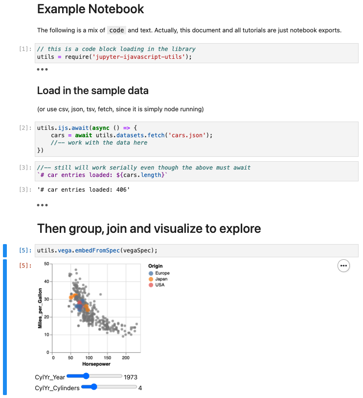

# What's New

* 1.20 - fix vega dependency
* 1.19 - add in describe and hashMap modules, along with format.limitLines
* 1.18 - tie to vega-datasets avoiding esmodules until ijavascript can support them
* 1.17 - provide object.propertyValueSample - as a way to list 'non-empty' property values
* 1.16 - provide file.matchFiles - as a way to find files or directories
* 1.15 - provide object.formatProperties - as a way to quickly convert to string, number, etc.
* 1.14 - provide format.compactNumber and object.mapProperties
* 1.13 - provide utils.random() to genrate random values
* 1.12 - provide `utils.table(...)` instead of `new utils.TableGenerator(...)`
* 1.11 - provide topValues (like top 5, bottom 3)
* 1.10 - provide percentile (like 50th percentile) aggregates
* 1.9 - allow transposing results on TableGenerator.
* 1.8 - add in What can I Do tutorial, and object.join methods
* 1.7 - revamp of `animation` method to htmlScript
* 1.6 - add SVG support for rendering SVGs and animations
* 1.5 - Add Latex support for rendering Math formulas and PlantUML support for Diagrams
* 1.4 - Add in vega embed, vega mimetypes and example choropleth tutorial
* 1.3 - Add Leaflet for Maps, allow Vega to use explicit specs (so [Examples can be copied and pasted](https://vega.github.io/vega-lite/examples/), and add in htmlScripts

# Running Your Own Notebooks

A many of the tutorials are simply exports of Jupyter notebooks (*.ipynb),
found under the [docResources/notebooks](https://github.com/paulroth3d/jupyter-ijavascript-utils/tree/main/docResources/notebooks) folder.

(Note that if you wish to `require` additional packages - like `jupyter-ijavascript-utils`,
simply create a package in the folder you will run the `jupyter lab` command
- such as the sample one under [docResources/notebooks/package.json](https://github.com/paulroth3d/jupyter-ijavascript-utils/blob/main/docResources/notebooks/package.json))

## Google Collab

You can very easily use iJavaScript and the jupyter-ijavascript-utils within Google Collab.

[See the excellent writeup from Alexey Okhimenko](https://dev.to/obenjiro/silence-of-the-fans-part-1-javascript-quickstart-5f3m)

And the shortlink to run your own: [https://tinyurl.com/tf-js-colab](https://tinyurl.com/tf-js-colab)

Steps Overview:

* Clone the Google Collab Document
* Run the first cell
  * If you notice an error `unrecognized runtime "JavaScript"` - that's expected
* Refresh your browser (see [Alexey's writeup for more](https://dev.to/obenjiro/silence-of-the-fans-part-1-javascript-quickstart-5f3m))
* Run a cell to install modules, ex: `sh('npm install jupyter-ijavascript-utils')`
* Then continue to run your code past this point.

## Running on Binder

!TODO

[mybinder.org](https://mybinder.org/) is a great place to run a Jupyter Notebook online.

We are still attempting to sort out a suitable link that will work for everyone
(without overloading their service)

(Please see [Issue #4](https://github.com/paulroth3d/jupyter-ijavascript-utils/issues/4))

# For Example

## Get Sample Data

([See the DataSets module for more on sample datasets](https://jupyter-ijavascript-utils.onrender.com/module-datasets.html))

([See the ijs module for helpers to use async/await](https://jupyter-ijavascript-utils.onrender.com/module-ijs.html#.await))

```
//-- get the data
utils.ijs.await(async ($$, console) => {
	barley = await utils.datasets.fetch('barley.json');

	//-- continue to use the barley dataset, or wait to the next cell
});
```

## Group By

Then we can group using a process similar to d3js

([See the Group Module for more on grouping](https://jupyter-ijavascript-utils.onrender.com/module-group.html))

```
//-- get the min max of the types of barley
barleyByVarietySite = utils.group.by(barley, 'variety', 'site')

// SourceMap(10) [Map] {
//   'Manchuria' => SourceMap(6) [Map] {
//     'University Farm' => [ [Object], [Object] ],
//     'Waseca' => [ [Object], [Object] ],
//     'Morris' => [ [Object], [Object] ],
//     'Crookston' => [ [Object], [Object] ],
//     'Grand Rapids' => [ [Object], [Object] ],
//     'Duluth' => [ [Object], [Object] ],
//     source: 'site'
//   },
//   'Glabron' => SourceMap(6) [Map] {
//     'University Farm' => [ [Object], [Object] ],
//     'Waseca' => [ [Object], [Object] ],
//     'Morris' => [ [Object], [Object] ],
//     'Crookston' => [ [Object], [Object] ],
//     'Grand Rapids' => [ [Object], [Object] ],
//     'Duluth' => [ [Object], [Object] ],
//     source: 'site'
//   },
//   ...
// }

//-- now group by variety and year
barleyByVarietyYear = utils.group.by(barley, 'variety', 'year')

// SourceMap(10) [Map] {
//   'Manchuria' => SourceMap(2) [Map] {
//     1931 => [ [Object], [Object], [Object], [Object], [Object], [Object] ],
//     1932 => [ [Object], [Object], [Object], [Object], [Object], [Object] ],
//     source: 'year'
//   },
//   'Glabron' => SourceMap(2) [Map] {
//     1931 => [ [Object], [Object], [Object], [Object], [Object], [Object] ],
//     1932 => [ [Object], [Object], [Object], [Object], [Object], [Object] ],
//     source: 'year'
//   },
//   ...
// }
```

##  Aggregating

([See the Aggregation module for more](https://jupyter-ijavascript-utils.onrender.com/module-aggregate.html))

```
utils.group.by(barley, 'variety', 'site')
    .reduce((collection) => ({
        years: utils.aggregate.extent(collection, 'year'),
        numRecords: utils.aggregate.length(collection),
        yield_sum: utils.aggregate.sum(collection, 'yield'),
        yield_min: utils.aggregate.min(collection, 'yield'),
        yield_max: utils.aggregate.max(collection, 'yield'),
        yield_diff: utils.aggregate.difference(collection, 'yield')
    }));

returns
[
  {
    variety: 'Manchuria',
    site: 'University Farm',
    years: { min: 1931, max: 1932 },
    numRecords: 2,
    yield_sum: 53.9,
    yield_min: 26.9,
    yield_max: 27,
    yield_diff: 0.100
  },
  {
    variety: 'Manchuria',
    site: 'Waseca',
    years: { min: 1931, max: 1932 },
    numRecords: 2,
    yield_sum: 82.33333,
    yield_min: 33.46667,
    yield_max: 48.86667,
    yield_diff: 15.39999
  },
  ...
];
```

## Render as a Table

([See the TableGenerator class for more](https://jupyter-ijavascript-utils.onrender.com/TableGenerator.html))

```
new utils.TableGenerator(barley)
    .sort('-yield')
    .formatter({ year: (v) => `${v}`})
    .limit(10)
    .render()
```

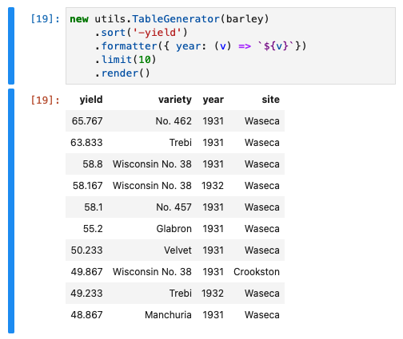

## Show a Graph

(See the {@tutorial vegaLite1} tutorial or the {@link module:vega|Vega module} for more)

```
//-- make a point chart
utils.vega.svg((vl) => vl.markPoint()
    //-- data as an array of items
    .data(barley)
    .title('Barley Yield by Site')
    .width(600)
    .encode(
        //-- x position is Nominal - not a number
        vl.x().fieldN('site'),
        //-- y position is Quantitative - a number
        vl.y().fieldQ('yield'),
        //-- Color is based on the year field
        vl.color().fieldN('year')
    )
)
```

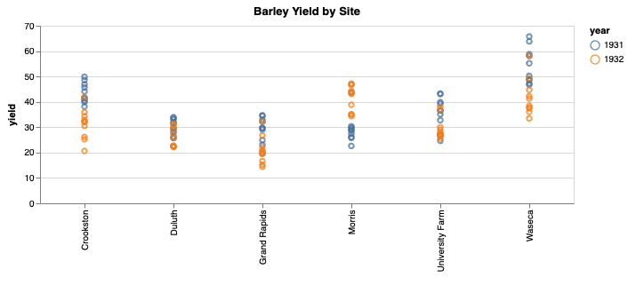

Where making it into a bar chart, to understand the proportions of varieties grown is simply changing the mark type

```
// change from markPoint to markBar
utils.vega.svg((vl) => vl.markBar()
    //-- data as an array of items
    .data(barley)
    .title('Barley Yield by Site Variety')
    .width(600)
    .encode(
        //-- x position is Nominal - not a number
        vl.x().fieldN('site').title('Site'),
        //-- y position is Quantitative - a number
        vl.y().fieldQ('yield').title('Yield'),
        //-- Color is based on the variety field
        vl.color().fieldN('variety').title('Variety')
    )
)
```

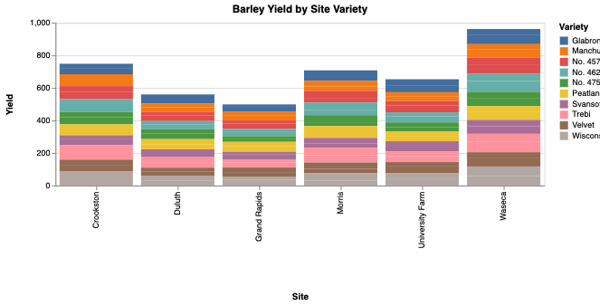

With further options to zoom, pan, or setup interactive sliders:

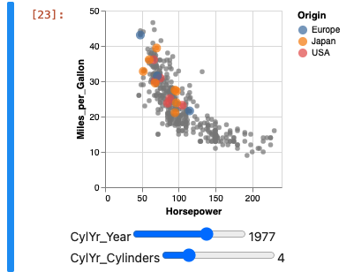

Or try your hand at the [Vega Lite Examples](https://vega.github.io/vega-lite/examples/)

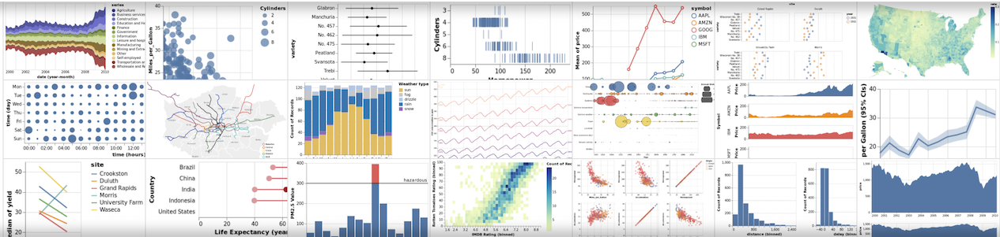

## Create a Data Driven Map

([See the Data Driven Maps Tutorial for More](https://jupyter-ijavascript-utils.onrender.com/tutorial-vega_choroplethLong.html))


## Render Maps

([See the Leaflet module for more](https://jupyter-ijavascript-utils.onrender.com/module-leaflet.html))

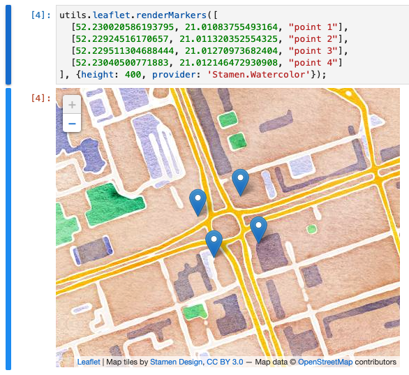

## Generate Text Driven Diagrams

([See the PlantUML module for more](https://jupyter-ijavascript-utils.onrender.com/module-plantuml.html))

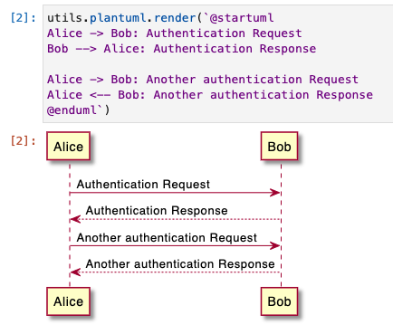

## Render Other Libraries

([See the Html Script Tutorial for more](https://jupyter-ijavascript-utils.onrender.com/tutorial-htmlScript.html))

```
utils.ijs.htmlScript({
    scripts: ['https://cdnjs.cloudflare.com/ajax/libs/qrcodejs/1.0.0/qrcode.min.js'],
    height: '100%',
    onReady: ({rootEl}) => {
        new QRCode(rootEl, "https://jupyter-ijavascript-utils.onrender.com/");
    }
});
```

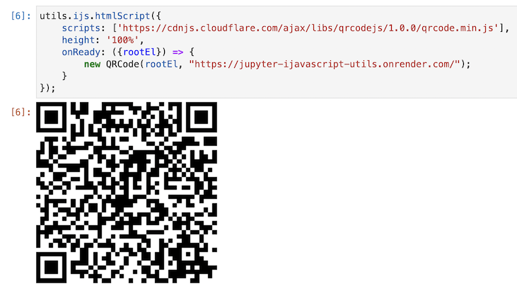

## Create Animations

(See the [Noise Visualization Tutorial](https://jupyter-ijavascript-utils.onrender.com/tutorial-noiseVisualization.html) or [SVG Module](file:///Users/proth/Documents/notebooks/jupyter-ijavascript-utils/docs/module-svg.html) for more)

[](docResources/img/svgAnimation2Dark.gif)

[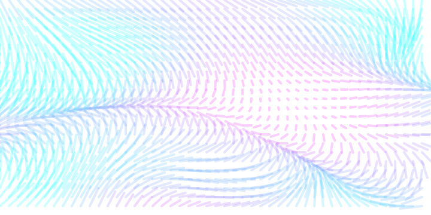](docResources/img/svgAnimation2Light.gif)

(click the image to play the gif animation)

# License

See [License](https://jupyter-ijavascript-utils.onrender.com/LICENSE) (MIT License).

# Issues

If you have any questions first file it on [issues](https://github.com/paulroth3d/jupyter-ijavascript-utils/issues) before contacting authors.

## Toubleshooting

iJavaScript does not currently support AMD Modules, due to open issues with nodejs [see iJavaScript issue #210 for more](https://github.com/n-riesco/ijavascript/issues/210)

# Contributions

Your contributions are welcome: both by reporting issues on [GitHub issues](https://github.com/paulroth3d/jupyter-ijavascript-utils/issues) or pull-requesting patches.

If you want to implement any additional features, to be added to JSforce to our master branch, which may or may not be merged please first check current [opening issues](https://github.com/paulroth3d/jupyter-ijavascript-utils/issues?q=is%3Aopen) with milestones and confirm whether the feature is on road map or not.

If your feature implementation is brand-new or fixing unsupposed bugs in the library's test cases, please include addtional test codes in the `src/__tests__/` directory.


## Further Reading

* [JSDoc Templates](https://cancerberosgx.github.io/jsdoc-templates-demo/demo/)
* [DocDash Template](http://clenemt.github.io/docdash/)
* [DocDash Example Code](http://clenemt.github.io/docdash/base_chains.js.html)
* [Gist creating JSDoc to MD](https://gist.github.com/slorber/0bf8c8c8001505f0f99a062ac55bf442)
* [JSDoc Documentation](https://jsdoc.app/index.html)
* [D3 Grouping / Data Transformation](https://observablehq.com/@d3/d3-group)
* [Danfo](https://danfo.jsdata.org/api-reference/plotting/tables)
* [DataFrame-js](https://github.com/Gmousse/dataframe-js)
* [ES21 array](https://developer.mozilla.org/en-US/docs/Web/JavaScript/Reference/Global_Objects/Array/flat)
